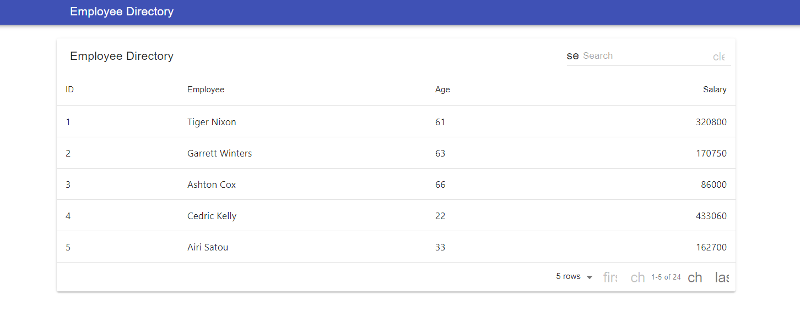

# User Directory

## Description

This application is intended to organize a companys employee registrar with simple to use features within the browser.

## Table of Contents

* [Features](#Features)
* [Links](#Links)
* [Screenshots](#Screenshots)
* [Language](#Language)

## Features

- [x] User is allowed to view entire employee directory.
- [x] User is allowed to search for employee.

## Links

* Project Repo: [Repository](https://github.com/Darrellfr3/User-Directory)
* GitHub Page: [Website](https://jeishu.github.io/work-day-scheduler/)

## Screenshots

## Language

* JavaScript
* HTML
* CSS
* [react](https://jquery.com/)
* [axios](https://jquery.com/)
* [material-table](https://jquery.com/)
* [react-dom](https://jquery.com/)
